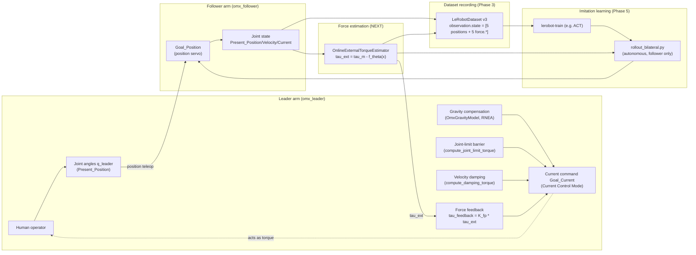
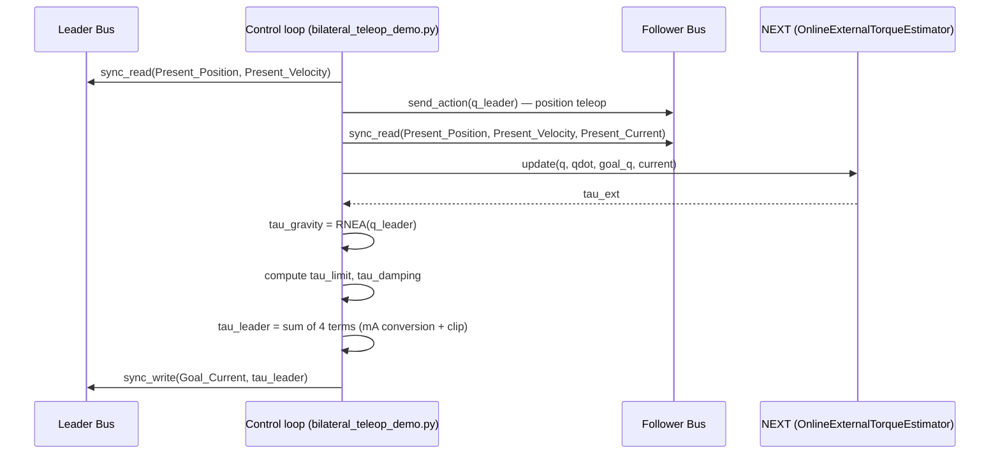
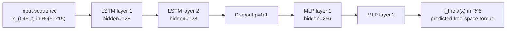

# OMX Bilateral Force-Feedback Teleoperation — Technical Report

Target hardware: ROBOTIS OpenManipulator-X (`omx_follower` / `omx_leader`) · Framework: [HuggingFace LeRobot](https://github.com/huggingface/lerobot) · Branch: `exp/omx-force-feedback`

> This document is written in Markdown and can be converted to PDF with, e.g., `pandoc examples/omx/TECHNICAL_REPORT_en.md -o report.pdf`. Math uses LaTeX notation (`$...$` inline, `$$...$$` block), and figures use Mermaid fenced code blocks. Both render natively on GitHub. If converting to PDF with pandoc, rendering the Mermaid diagrams additionally requires something like `mermaid-filter`. See [`TECHNICAL_REPORT_ja.md`](./TECHNICAL_REPORT_ja.md) for the Japanese version.

---

## Abstract

On the ROBOTIS OpenManipulator-X — an inexpensive 5-DOF manipulator with no dedicated force/torque sensor — we reproduced FACTR2's **NEXT (Neural External Torque Estimation)** to estimate external force from the motors' `Present_Current`/`Present_Load` values alone. We used this estimate to build a **bilateral teleoperation** system that feeds it back to the leader arm, and further integrated the estimated force into the `observation.state` of LeRobot v3 datasets, implementing an end-to-end pipeline from recording force-aware imitation-learning demonstrations through inference with a trained policy on real hardware. Along the way we found and fixed a gripper malfunction caused by Dynamixel firmware behavior around `Torque_Enable` toggling, and characterized (and accepted as a known limitation) a follower end-effector position offset that appears when the arm is fully extended, traced to residual gravity-compensation error.

---

## Table of Contents

1. [Overview](#1-overview)
2. [Technical Theory](#2-technical-theory)
3. [Code Overview](#3-code-overview)
4. [Tutorial: From Free-Motion Data Collection to Force-Aware Dataset Recording](#4-tutorial-from-free-motion-data-collection-to-force-aware-dataset-recording)
5. [Command Reference](#5-command-reference)
6. [References](#6-references)

---

## 1. Overview

### 1.1 Background and Motivation

Learning autonomous robot manipulation via imitation learning requires high-quality demonstration data collected by a human operating the robot. For tasks that involve contact with objects (insertion, fitting, pressing against a surface, etc.), vision alone makes it hard to tell whether contact has occurred and how much force is being applied — demonstrations that carry force information are believed to help here.

However, many inexpensive robot arms (including this one) have no dedicated force/torque sensor. This project therefore uses **NEXT**, a technique proposed by FACTR2, to estimate external force purely from the motors' own current/load registers. Using this estimated force, we implemented, on top of the existing HuggingFace LeRobot framework and without modifying the core classes (`OmxFollower`/`OmxLeader`), an end-to-end pipeline that:

1. provides force feedback to the leader arm (bilateral teleoperation),
2. folds force information into the observations of the datasets we record, and
3. keeps using the same force estimate at inference time with a trained policy.

### 1.2 Introducing OMX-AI

The **ROBOTIS OpenManipulator-X** (referred to here by the nickname *OMX-AI*) is a small robot arm sold by the Korean company ROBOTIS for education and research. LeRobot already ships two classes for it as a leader/follower bilateral teleoperation kit: `omx_follower` (the working arm) and `omx_leader` (the operator's arm).

| Item | Details |
|---|---|
| Degrees of freedom | 5 axes (shoulder_pan, shoulder_lift, elbow_flex, wrist_flex, wrist_roll) + gripper |
| Actuators | ROBOTIS Dynamixel X-series servo motors (see table below) |
| Configuration | Identical leader (human-operated) and follower (working) arms |
| Communication | Dynamixel TTL half-duplex serial bus (USB, `DynamixelMotorsBus`) |
| LeRobot support | Already supported as `src/lerobot/robots/omx_follower/`, `src/lerobot/teleoperators/omx_leader/` |

Note that the follower and leader use different motor models on some joints (this directly matters for the force-estimation constraints detailed in §2.5).

| Joint | Follower | Leader |
|---|---|---|
| shoulder_pan | XL430-W250 | XL330-M288 |
| shoulder_lift | XL430-W250 | XL330-M288 |
| elbow_flex | XL430-W250 | XL330-M288 |
| wrist_flex | XL330-M288 | XL330-M288 |
| wrist_roll | XL330-M288 | XL330-M288 |
| gripper | XL330-M288 | XL330-M077 |

### 1.3 System Architecture



### 1.4 Target Hardware Configuration

The command examples in this report assume the following setup (adjust to your own environment).

| Item | Default |
|---|---|
| Follower connection port | `/dev/ttyACM0` |
| Leader connection port | `/dev/ttyACM1` |
| Follower ID | `omx_follower` |
| Leader ID | `omx_leader` |
| Leader URDF | `omx_l.urdf` (from [ROBOTIS-GIT/open_manipulator](https://github.com/ROBOTIS-GIT/open_manipulator/blob/main/open_manipulator_description/urdf/omx_l/omx_l.urdf), passed via `--urdf_path`) |

---

## 2. Technical Theory

### 2.1 Fundamentals of Bilateral Control

Bilateral teleoperation is a remote-operation scheme in which the leader (operator side) and follower (working side) exchange position and force information in both directions. Feeding the follower's estimated external force $\tau_{ext}$ back to the leader's actuators lets the operator feel the sense of contact while working remotely. This implementation follows the simple proportional feedback law used by the original FACTR.

$$
\tau_{feedback} = K_{fp} \cdot \tau_{ext}
$$

Here $K_{fp}$ corresponds to `--feedback_gain` in the implementation. The leader is driven in Dynamixel's Current Control Mode, writing a current command (`Goal_Current`) that combines the following four terms at every control step.

$$
\tau_{leader} = \tau_{gravity} + \tau_{limit} + \tau_{damping} + \tau_{feedback}
$$

Each term is detailed in §2.3 and §2.4. The implementation corresponds to the main loop of `examples/omx/bilateral_teleop/bilateral_teleop_demo.py`.



`tau_ext` is expressed in the follower's raw register units (not converted to Nm, see §2.5), so there is no guarantee its sign intuitively matches "the direction to push back." On hardware, we confirmed `tau_ext`'s sign (FACTR2/NEXT's own definition, unchanged: $\tau_{ext} = \tau_m - f_\theta(x)$) is opposite the intuitive direction. This is not a register-configuration mistake like the gripper's `Drive_Mode` mismatch (§2.7, Phase 6) — the arm joints' `Drive_Mode` matches between leader and follower, and position teleop and gravity compensation both work correctly with no sign flip, so the discrepancy is specific to translating a current/torque residual into a command for the leader. We therefore left `tau_ext` itself unchanged and instead apply a constant `FEEDBACK_SIGN = -1.0` only inside the feedback-torque conversion function, `leader_safety.compute_feedback_torque()`. With this fix, **a positive `--feedback_gain` (around `0.3`) now renders feedback in the intuitive direction** (internally, this produces the exact same current command as the previous `-0.3` did).

#### 2.1.1 Classification of Bilateral Control Schemes

Bilateral control is generally classified into the following three schemes, based on the combination of control laws used on the master (leader) and slave (follower) sides (classification per the [Japan Society of Mechanical Engineers' Medical Engineering Technology wiki](https://www.jsme.or.jp/jsme-medwiki/doku.php?id=14:1010059), [9]).

| Scheme | Slave side | Master side |
|---|---|---|
| **Symmetric type** (対称型) | Position control (master's position as target) | Position control (slave's position as target). Both arms form a closed loop, each tracking the other's position as its target. |
| **Force-reflecting type** (力逆送型) | Position control (master's position as target) | The contact force detected at the slave is **reflected back and drives the master arm**. |
| **Force-feedback type** (力帰還型) | Position control (master's position as target) | The master arm is **force-controlled**, with the contact force detected at the slave as the **target** (a closed force-control loop exists on the master side). |

The symmetric type needs no dedicated force/torque sensor; the position error itself generates force, acting like a virtual spring. Both the force-reflecting and force-feedback types use the contact force detected at the slave, but they differ in how the master side handles it. The force-reflecting type additively "reflects the slave's detected force back to drive" the master, whereas the force-feedback type has an **independent, closed force-control loop** that drives the master's own generated force to track the detected force — reportedly giving better force fidelity and a lower apparent arm inertia than the force-reflecting type.

**This implementation is a force-reflecting type.** In the combined-current formula from §2.1,

$$
\tau_{leader} = \tau_{gravity} + \tau_{limit} + \tau_{damping} + \underbrace{K_{fp} \cdot \tau_{ext}}_{\tau_{feedback}}
$$

the $\tau_{feedback}$ term is **merely added** to the leader's current command — the follower's estimated external force $\tau_{ext}$ multiplied by a proportional gain $K_{fp}$ — with no mechanism that measures the force the leader itself is generating and closes a loop to track a target force. This matches the definition of the force-reflecting type — "the contact force detected at the slave is reflected back to the master side and drives the master arm" — exactly, structurally. The position control also matches the force-reflecting type's premise: the follower tracks the leader's position as its target (`follower_action = {j.pos: q_leader[j] for j in ARM_JOINTS}` → `follower.send_action()`).

However, the force-reflecting type's definition presupposes a contact force "**detected**" at the slave, whereas this implementation's follower has no dedicated force/torque sensor — NEXT (§2.2) instead **estimates** external force from the motor current values. The most accurate description of this implementation is therefore **a sensorless, force-reflecting-type bilateral control**.

### 2.2 External Force Estimation with NEXT

Since the follower's Dynamixel motors have no dedicated force/torque sensor, we reproduced **NEXT (Neural External Torque Estimation)**, as proposed by FACTR2. The basic idea is to learn, via a neural network, "the motor current/load that would be observed in free space with no contact" from a time series of joint angle, velocity, and target-tracking error, and to treat the residual against the measured value as the external-force estimate.

**Feature vector** (at time $t$, with $n=5$ joints):

$$
x_t = \big[\, q_t,\ \dot q_t,\ q_{goal,t} - q_t \,\big] \in \mathbb{R}^{3n}
$$

The most recent `history_length` (default 50) steps' worth, $x_{t-49}, \dots, x_t$, are fed into the LSTM as a time series.

**Model architecture** (`src/lerobot/force_estimation/next_model.py`):



**Inference rule** (corresponds to FACTR2 paper eq. 2):

$$
\tau_{ext} = \tau_m - f_\theta(x)
$$

$\tau_m$ is the measured motor current/load (`Present_Current`), and $f_\theta(x)$ is the trained model's predicted free-space torque.

**Training**: trained by L2 regression (AdamW, `lr=1e-3`, `weight_decay=1e-6`) on roughly 10 minutes of contact-free free-motion data at 100Hz.

$$
\mathcal{L}(\theta) = \frac{1}{N}\sum_{i=1}^{N} \big\| \tau_{m,i} - f_\theta(x_i) \big\|_2^2
$$

Inputs and outputs are standardized (zero-mean, unit-std) for training; the standardization statistics $(\mu_x, \sigma_x, \mu_y, \sigma_y)$ are saved in the checkpoint and applied automatically at inference time (`OnlineExternalTorqueEstimator`).

$$
\hat x = \frac{x - \mu_x}{\sigma_x}, \qquad f_\theta(x) = f_\theta^{norm}(\hat x) \cdot \sigma_y + \mu_y
$$

Corresponding implementation: `src/lerobot/force_estimation/{next_model.py, dataset.py, train.py, online.py}`.

### 2.3 Gravity Compensation (RNEA)

Driving the leader arm in Current Control Mode disables the firmware's position servo, so gravity-compensation torque that cancels the arm's own weight must be computed and added every step. A manipulator's general equation of motion is

$$
M(q)\ddot q + C(q,\dot q)\dot q + g(q) = \tau
$$

where $M(q)$ is the inertia matrix, $C(q,\dot q)$ the Coriolis/centrifugal term, and $g(q)$ the gravity term. Substituting $\dot q = \ddot q = 0$ into RNEA (the Recursive Newton-Euler Algorithm) zeroes out the inertia and Coriolis terms, leaving only the gravity term $g(q)$.

$$
\tau_g = \mathrm{RNEA}(model,\ q,\ \mathbf{0},\ \mathbf{0}) = g(q)
$$

This implementation uses the rigid-body-dynamics library Pinocchio's `pin.rnea()` (`OmxGravityModel.compute_gravity_torque()`). To load the URDF without requiring mesh files, it uses `pin.buildModelFromUrdf()` (rather than `RobotWrapper.BuildFromURDF`).

The conversion from LeRobot's normalized position (`RANGE_M100_100`, $-100$ to $100$) to the URDF's radian representation is:

$$
q_{rad} = s_j \cdot \frac{q_{norm}}{100} \cdot \pi + o_j
$$

$s_j$ (`joint_sign`, default $+1$) and $o_j$ (`joint_offset_rad`, default $0$) are per-joint sign/offset parameters, confirmed on hardware using `preview_gravity_model.py`.

The resulting torque $\tau_g$ (Nm) is converted to a current command (mA) using an empirical torque constant $K_T$ (`KT_NM_PER_A = 0.36`) and a gain `modifier`.

$$
I_{gravity}\,[\mathrm{mA}] = \frac{\tau_g}{K_T} \cdot \mathrm{modifier} \cdot 1000
$$

Corresponding implementation: `src/lerobot/teleoperators/omx_leader/gravity_compensation.py`, `leader_safety.py`.

### 2.4 Safety: Joint-Limit Barrier and Velocity Damping

Dynamixel's Current Control Mode has no firmware position servo, so `Min/Max_Position_Limit` has no effect at all. A software-side, FACTR-style soft joint-limit barrier is therefore implemented to prevent runaway motion. The repulsive term only acts outside a range shrunk inward by a safety margin $m$ (`JOINT_LIMIT_SAFETY_MARGIN = 5.0`), i.e. outside $[q_{lo}+m,\ q_{hi}-m]$.

$$
\tau_{limit} =
\begin{cases}
-k_p (q - (q_{hi}-m)) - k_d \dot q & \text{if } q > q_{hi}-m \\
-k_p (q - (q_{lo}+m)) - k_d \dot q & \text{if } q < q_{lo}+m \\
0 & \text{otherwise}
\end{cases}
$$

A velocity-damping term is also added at all times to preserve controllability.

$$
\tau_{damping} = -k_{damp} \cdot \dot q
$$

The hardware-specific joint limits confirmed on real hardware (normalized units, measured on one leader unit) are:

| Joint | Lower bound | Upper bound |
|---|---|---|
| shoulder_pan | -52.4 | 50.9 |
| shoulder_lift | -68.0 | 48.2 |
| elbow_flex | -59.3 | 54.3 |
| wrist_flex | -48.8 | 50.3 |
| wrist_roll | -100.0 | 100.0 (continuous-rotation joint) |

Corresponding implementation: `src/lerobot/teleoperators/omx_leader/leader_safety.py` (`JOINT_LIMIT_RANGE`, `compute_joint_limit_torque`, `compute_damping_torque`).

### 2.5 Dynamixel Register Semantics and Force-Estimation Constraints

The "current" used as input to force estimation has a different physical meaning depending on the motor model. The follower's `shoulder_pan`/`shoulder_lift`/`elbow_flex` are XL430-W250, and the register LeRobot uniformly calls `Present_Current` is, on these motors, actually **Present Load** per the ROBOTIS e-manual (a load ratio estimated from the internal PWM duty cycle, in units of 0.1%) — not a true current value. `wrist_flex`/`wrist_roll`, on the other hand, are XL330-M288, which do have a current sensor, but it measures input-supply-side current rather than motor phase current.

Because the physical meaning differs per joint, this implementation does not convert to Nm via a torque constant; instead, each joint's raw register value is treated as "that joint's own torque-proxy signal," leaving the standardization and the data-driven LSTM (§2.2) to absorb the scale differences.

### 2.6 Integrating Force Information into the Dataset

To use the estimated external force for imitation learning, it must be recorded as a feature in the LeRobot v3 dataset. Rather than a separate key like `observation.force`, this implementation extends the existing `observation.state` (5 position dims + 5 force dims = 10 dims).

$$
\texttt{observation.state} = [\,q_{shoulder\_pan}, \dots, q_{wrist\_roll},\ \tau_{ext,shoulder\_pan}, \dots, \tau_{ext,wrist\_roll}\,] \in \mathbb{R}^{10}
$$

The reason: `PreTrainedConfig.robot_state_feature` (`src/lerobot/configs/policies.py`) only automatically treats the exact key name `"observation.state"` as policy input — any other `observation.*` key is never picked up by training without policy-side code changes. This extension is achieved purely with the existing utility `combine_feature_dicts()`, with no changes at all to core classes such as `OmxFollower`.

### 2.7 Pitfalls Discovered During Implementation

**Side effect of Dynamixel `Torque_Enable` toggling (Phase 6)**: We confirmed on hardware that toggling a Dynamixel motor's `Torque_Enable` from OFF to ON, while in `CURRENT_POSITION` mode, causes it to behave as if `Goal_Position` had been re-locked to whatever `Present_Position` was at that exact moment. This is not something LeRobot's own `enable_torque()`/`disable_torque()` do (they only write the `Torque_Enable` register) — it is Dynamixel firmware behavior. A `torque_disabled()` call with no target motors specified drags in unintended motors (the gripper, in this implementation), so **the target motors must always be explicitly scoped**.

**Residual gravity-compensation error amplified by the Jacobian (Phase 7)**: With the leader arm posed at full extension, we confirmed the follower's end-effector position can be off by up to roughly 1–2cm. Root-causing this showed that neither the joint-limit barrier nor velocity damping contribute in steady state (a pose held still, $\dot q \approx 0$); the cause is **residual gravity-compensation error**, the one term that stays active at rest. A joint-angle error $\delta q$ is transformed into an end-effector position error via the Jacobian $J(q)$.

$$
\delta x \approx J(q)\, \delta q
$$

The norm of the Jacobian generally grows as the arm extends (i.e. as the distance from the base grows), so the same magnitude of joint-angle error shows up as a larger end-effector position error in an extended pose (the so-called lever-arm effect). In addition, the gravity-compensation torque actually required is also larger when extended, so the absolute magnitude of a proportional gain error tends to be larger too. `--modifier` is an empirical gain tuned to "feel comfortable," not a physically exact calibration, so this error is currently **accepted as a known limitation**.

---

## 3. Code Overview

### 3.1 Core Package (`src/lerobot/`)

Existing classes (`OmxFollower`/`OmxLeader`) are left unmodified; everything here is additive.

| File | Role |
|---|---|
| `force_estimation/next_model.py` | `NextTorqueEstimator` (`nn.Module`). The FACTR2 NEXT model body: a 2-layer LSTM (hidden=128) + 2-layer MLP head (hidden=256), dropout 0.1. |
| `force_estimation/dataset.py` | `FreeMotionEpisode`, `load_episode()`, `resample_uniform()`, `NextWindowDataset`. Loading `.npz` logs, resampling to a uniform rate, and extracting training windows. |
| `force_estimation/train.py` | `NextTrainConfig`, `train_next()`. Training loop with L2 regression and early stopping. Saves standardization statistics in the checkpoint. |
| `force_estimation/online.py` | `OnlineExternalTorqueEstimator`. Keeps a history in a ring buffer and computes $\tau_{ext}$ every step. Supports optional EMA smoothing via `smoothing_alpha`. |
| `teleoperators/omx_leader/gravity_compensation.py` | `OmxGravityModel`. Gravity-compensation torque computation via Pinocchio RNEA, and mapping to URDF joint names. Documents the known limitation (Phase 7). |
| `teleoperators/omx_leader/leader_safety.py` | Shared leader-control logic: entering/leaving Current Control Mode (`enter_current_control_mode`/`restore_position_mode`), the joint-limit barrier, velocity damping, and per-joint gain resolution. Location of the Phase 6 bug fix. |

### 3.2 Scripts (`examples/omx/`)

**Force estimation pipeline** (`force_sensing/`)

| File | Role |
|---|---|
| `collect_free_motion.py` | Collects contact-free free-motion data. Reuses `record_grab.py`'s safe coupled joint range. |
| `train_next.py` | CLI wrapper around `train_next()`. |
| `demo_force_sensing.py` | Real-time external-force-estimation demo on hardware. |
| `evaluate_free_motion.py` | Replays collected free-motion logs through inference and computes noise-floor reference statistics (`mean`/`std`/`max|.|`, plus a +/- side asymmetry breakdown). |
| `evaluate_dataset_force.py` | Extracts the `force.*` columns from a recorded LeRobotDataset's `observation.state` and shows overall/per-episode statistics. |

**Gravity compensation** (`gravity_compensation/`)

| File | Role |
|---|---|
| `preview_gravity_model.py` | Read-only diagnostic that prints RNEA results to the console without driving any current. Used to verify sign/URDF mapping. |
| `find_leader_joint_range.py` | Manually moves the (torque-off) arm to measure each joint's practical range of motion. |
| `gravity_comp_demo.py` | Standalone demo of gravity compensation + joint-limit barrier + damping only. The foundation for the bilateral scripts. |

**Bilateral control** (`bilateral_teleop/`)

| File | Role |
|---|---|
| `bilateral_teleop_demo.py` | The main loop for position teleop + force feedback. |
| `record_bilateral.py` | Adds LeRobotDataset recording on top of the loop above. Supports cameras, Hub upload, and `--resume`. |
| `rollout_bilateral.py` | Runs a trained policy autonomously with the follower alone, no leader. |

**Diagnostic scripts** (directly under `examples/omx/`)

| File | Role |
|---|---|
| `diagnose_gripper.py` | Diagnoses the gripper's `Drive_Mode`/`Homing_Offset`, a live test of the gripper relay in isolation, and isolating the effect of Current Control Mode (Phase 6). |
| `diagnose_pose.py` | Live comparison of the leader's and follower's joint angles (Phase 7). |

---

## 4. Tutorial: From Free-Motion Data Collection to Force-Aware Dataset Recording

This tutorial walks through, starting from nothing: (1) training the NEXT external-force-estimation model, (2) confirming bilateral teleoperation works, and (3) recording a demonstration dataset that includes force information — in execution order. Everything is run from the repository root in the form `uv run python -m examples.omx....`.

### Step 0: Environment Setup

```bash
uv sync --extra dataset --extra kinematics --extra dev --extra test
```

The `kinematics` extra includes Pinocchio (required for gravity compensation). Connect the follower and leader over USB and confirm their ports (default `/dev/ttyACM0`/`/dev/ttyACM1`).

### Step 1: Free-Motion Data Collection

To learn the motor behavior in free space with no contact, clear the workspace of any objects and move the follower alone for roughly 10 minutes while logging.

```bash
uv run python -m examples.omx.force_sensing.collect_free_motion \
    --port /dev/ttyACM0 --robot_id omx_follower \
    --output data/omx_free_motion/run1.npz --duration_min 12
```

It's fine to split collection across multiple sessions. **Check**: watch the console output during collection for any interruption due to `Hardware_Error_Status`.

### Step 2: Train the NEXT Model

```bash
uv run python -m examples.omx.force_sensing.train_next \
    --data data/omx_free_motion/run1.npz data/omx_free_motion/run2.npz \
    --output checkpoints/omx_next.pt
```

**Check**: does the validation loss in the training log decrease roughly monotonically until early stopping? `--resample-hz` defaults to 100, but it's worth matching it to the actually-achieved bilateral loop rate you measure in Step 5 onward (see §2.2, and the tuning section of `src/lerobot/force_estimation/README.md`).

### Step 3: Validate NEXT

Check that the trained model outputs only noise on contact-free data (i.e. that it's a reasonable free-space model).

```bash
uv run python -m examples.omx.force_sensing.evaluate_free_motion \
    --checkpoint checkpoints/omx_next.pt \
    --data data/omx_free_motion/run1.npz data/omx_free_motion/run2.npz
```

**Check**: are the printed `mean`/`std`/`max|.|` small values close to zero? Next, confirm the response on real hardware by pressing on joints.

```bash
uv run python -m examples.omx.force_sensing.demo_force_sensing \
    --port /dev/ttyACM0 --checkpoint checkpoints/omx_next.pt
```

**Check**: when you press each joint lightly/firmly, does `tau_ext`'s sign and magnitude qualitatively match the direction/strength of the force?

### Step 4: Prepare and Verify Gravity Compensation

First, verify the leader's sign/URDF mapping without driving any current.

```bash
uv run python -m examples.omx.gravity_compensation.preview_gravity_model \
    --port /dev/ttyACM1 --robot_id omx_leader --urdf_path /path/to/omx_l.urdf
```

**Check**: are the displayed angles/torque signs physically sensible (does the torque direction match intuition as you move the arm)? If you haven't already, also measure the range of motion.

```bash
uv run python -m examples.omx.gravity_compensation.find_leader_joint_range \
    --port /dev/ttyACM1 --robot_id omx_leader
```

Cross-check/update the printed `JOINT_LIMIT_RANGE = {...}` against the values in `src/lerobot/teleoperators/omx_leader/leader_safety.py` (unnecessary if the values from §2.4 of this report are already in place). Finally, verify gravity compensation on its own. **Support the arm by hand before starting.**

```bash
uv run python -m examples.omx.gravity_compensation.gravity_comp_demo \
    --port /dev/ttyACM1 --robot_id omx_leader --urdf_path /path/to/omx_l.urdf \
    --modifier 0.09 --damping_gain 0.05 --joint_limit_kp 3 --joint_limit_kd 0
```

**Check**: does the arm stay up under its own weight when you let go, without falling? Does it oscillate near the joint limits?

### Step 5: Confirm Bilateral Teleoperation Works

First run with `--feedback_gain` left at its default `0.0` (disabled), to confirm position teleop plus the safety mechanisms alone. **Support the arm by hand the first time.**

```bash
uv run python -m examples.omx.bilateral_teleop.bilateral_teleop_demo \
    --follower_port /dev/ttyACM0 --follower_id omx_follower \
    --leader_port /dev/ttyACM1 --leader_id omx_leader \
    --urdf_path /path/to/omx_l.urdf --checkpoint checkpoints/omx_next.pt \
    --modifier 0.09 --modifier_shoulder_lift 0.1 \
    --modifier_shoulder_pan 0.0 --modifier_wrist_roll 0.0 \
    --damping_gain 0.05 --joint_limit_kp 3 --joint_limit_kd 0
```

**Check**: watch the achieved Hz and `tau_ext` printed to the console every second. Confirm the follower correctly tracks the leader's motion (including the gripper). Once this looks correct, enable force feedback.

```bash
uv run python -m examples.omx.bilateral_teleop.bilateral_teleop_demo \
    --follower_port /dev/ttyACM0 --leader_port /dev/ttyACM1 \
    --urdf_path /path/to/omx_l.urdf --checkpoint checkpoints/omx_next.pt \
    --modifier 0.09 --modifier_shoulder_lift 0.1 \
    --modifier_shoulder_pan 0.0 --modifier_wrist_roll 0.0 \
    --damping_gain 0.05 --joint_limit_kp 3 --joint_limit_kd 0 \
    --feedback_gain 0.3
```

**Check**: when you push on the follower's end-effector, does the reaction force reach the leader side? If the direction feels reversed, flip the sign of `--feedback_gain`.

### Step 6: Record a Dataset with Force Information

Once the behavior is confirmed, switch to the recording script with the same parameters.

```bash
uv run python -m examples.omx.bilateral_teleop.record_bilateral \
    --follower_port /dev/ttyACM0 --leader_port /dev/ttyACM1 \
    --urdf_path /path/to/omx_l.urdf --checkpoint checkpoints/omx_next.pt \
    --modifier 0.09 --modifier_shoulder_lift 0.1 \
    --modifier_shoulder_pan 0.0 --modifier_wrist_roll 0.0 \
    --damping_gain 0.05 --joint_limit_kp 3 --joint_limit_kd 0 --feedback_gain 0.3 \
    --repo_id <hf_username>/omx_bilateral_force --root data/omx_bilateral_force \
    --num_episodes 10 --episode_duration_s 30 --single_task "Pick up the cube" \
    --cameras="{ wrist: {type: opencv, index_or_path: 6, width: 640, height: 480, fps: 30, fourcc: MJPG} }" \
    --push_to_hub --hub_private --hub_tags omx bilateral force
```

**Check**: confirm the `observation.state` dimensionality/`names` printed in the log right after startup (is it 5 positions + 5 `force.*` = 10 dims?). To continue recording into an existing dataset's episodes, add `--resume` (`--root` is required).

**Note (if data-quality tuning is needed)**: if you want to inspect the distribution of the recorded dataset's `force.*` columns, you can diagnose it with (see §2.2, §2.7, and the "Tuning" section of `src/lerobot/force_estimation/README.md`):

```bash
uv run python -m examples.omx.force_sensing.evaluate_dataset_force \
    --repo_id <hf_username>/omx_bilateral_force --root data/omx_bilateral_force
```

### Step 7: Post-Retraining Quality Verification and Tuning

After retraining NEXT in Step 2, this workflow quantitatively checks whether accuracy actually improved. Naively comparing `evaluate_free_motion.py`'s noise-floor `mean`/`std` alone can be misleading if the test pose itself was not reproduced identically between the two collections (§2.7, pose-dependent bias). Follow the steps below in order.

**7.1 Check the training data's q-space coverage**

Whenever free-motion logs are added or replaced, first check whether the training data actually covers the pose(s) you want to validate against — especially the `shoulder_lift` × `elbow_flex` combination, the joint pair the pose-dependent bias concentrates in.

```bash
uv run python -m examples.omx.force_sensing.check_training_coverage \
    --data data/omx_free_motion/*.npz \
    --bins 20 \
    --reference data/omx_static_hold/pose1_unloaded.npz \
    --tolerance 5.0
```

**Check**: no `<-- EMPTY` / `<-- sparse` flags in the per-joint histograms. If `--reference` is given and the `shoulder_lift & elbow_flex jointly` count is near zero, that test pose is an unlearned (extrapolated) region for the model, and `tau_ext` there tends to be unstable across checkpoints. Treat comparisons at uncovered poses as inconclusive.

**7.2 Collect a pinned-pose unloaded/loaded pair**

`tau_ext` has a known pose-dependent bias, so even a few degrees of pose mismatch between an unloaded and loaded recording alone produces a `tau_ext` difference indistinguishable from a real load-detection signal. To avoid this, `collect_static_hold.py`'s `--output_loaded` pins the arm's commanded pose to a single fixed value for the entire connection, and grasps the test mass via a gripper-only teleop relay in between.

```bash
uv run python -m examples.omx.force_sensing.collect_static_hold \
    --port /dev/ttyACM0 --leader_port /dev/ttyACM1 \
    --duration_sec 15 --output data/omx_static_hold/pose1_unloaded.npz \
    --output_loaded data/omx_static_hold/pose1_loaded.npz
```

Teleoperate the arm into position, Ctrl+C to pin the pose → log unloaded for 15s → per the prompt, grasp the test mass via the leader's gripper only (the 5 arm-joint targets never change) → Ctrl+C → log loaded for 15s at the same pinned pose. Your hand never touches the arm or gripper.

**Check**: verify afterward that the pose really was pinned.

```bash
uv run python -m examples.omx.force_sensing.compare_pose_drift \
    --unloaded data/omx_static_hold/pose1_unloaded.npz \
    --loaded   data/omx_static_hold/pose1_loaded.npz
```

Confirm `shoulder_pan`'s (a joint with no coupling to the load) ratio is near zero. A large value there means the pose was likely positioned by hand without `--leader_port`, or the pair came from two separate teleop sessions — the subsequent τ_ext comparison cannot be trusted. A high ratio on a load-bearing joint like `wrist_flex` is not itself a problem if the delta's sign is consistent across repeats (e.g. same direction across 9 pairs) — that is more likely real servo sag under load than a data-collection artifact.

**7.3 Quantitatively compare τ_ext (old checkpoint vs. new checkpoint)**

For a pinned-pose pair confirmed above, run `evaluate_free_motion.py` against both the old and new checkpoint.

```bash
uv run python -m examples.omx.force_sensing.evaluate_free_motion \
    --checkpoint checkpoints/omx_next.pt --data data/omx_static_hold/pose1_unloaded.npz
uv run python -m examples.omx.force_sensing.evaluate_free_motion \
    --checkpoint checkpoints/omx_next.pt --data data/omx_static_hold/pose1_loaded.npz
```

Repeat against the retrained checkpoint (e.g. `checkpoints/omx_next2.pt`) on the same logs, and compare each joint's `mean` delta (loaded − unloaded) between the two checkpoints. If you collected multiple poses/repeats, compute delta's mean and std per pose across repeats, and check whether the sign is consistent (a small std relative to the mean).

**Check**:
- A joint/pose combination is a plausible load-detection candidate when the delta's sign is consistent across repeats and its std is small relative to its mean.
- If the new checkpoint's delta consistency improved, retraining helped. If it did not improve, or got worse at another pose, go back to 7.1 and re-check whether that pose is actually covered by the training data — behavior changes at uncovered poses usually reflect extrapolation noise, not genuine generalization improvement.

**Note: detailed per-joint pose-dependent bias diagnosis**

To see which joint/pose region carries the largest bias in `tau_ext`'s noise floor, bucket the free-motion logs themselves by pose bin.

```bash
uv run python -m examples.omx.force_sensing.evaluate_pose_dependence \
    --checkpoint checkpoints/omx_next.pt \
    --data data/omx_free_motion/*.npz \
    --bins 5 --qdot_threshold 2.0
```

`--qdot_threshold` restricts each joint's bins to samples where that joint's own velocity is low (near-static), making it easier to separate in-motion noise from a static systematic bias.

**7.4 Improving training-data coverage: teleoperated free-motion collection**

If 7.1 reveals a coverage gap — especially around poses the real task actually visits often — collecting motion that resembles the real task directly is usually more practical than widening `collect_free_motion.py`'s scripted sweep ranges (widening a sweep to reach poses the real task never uses, or the sweep still can't reach, doesn't translate into better accuracy). Leave the robot's motion entirely to the operator and log while teleoperating with an empty gripper (contact-free).

```bash
uv run python -m examples.omx.force_sensing.collect_free_motion_teleop \
    --port /dev/ttyACM0 --leader_port /dev/ttyACM1 \
    --output data/omx_free_motion/teleop_run1.npz
```

Move naturally around the poses the real task visits often (e.g. near the home position) with an empty gripper, then Ctrl+C to stop and save. Add the collected log to the existing free-motion logs, redo Step 2 (retraining), and re-check the improvement via 7.1–7.3.

---

## 5. Command Reference

### `force_sensing/collect_free_motion.py`

| Argument | Type | Default | Description |
|---|---|---|---|
| `--port` | str | `/dev/ttyACM0` | Follower connection port |
| `--robot_id` | str | `omx_follower` | Follower ID |
| `--output` | str | required | Output `.npz` path |
| `--duration_min` | float | — | Collection duration (minutes) |

### `force_sensing/train_next.py`

| Argument | Type | Default | Description |
|---|---|---|---|
| `--data` | str+ | required | `.npz` free-motion log(s) |
| `--output` | str | required | Output checkpoint path |
| `--history-length` | int | `50` | History length |
| `--resample-hz` | float | `100.0` | Resampling rate used for training |
| `--batch-size` | int | `256` | Batch size |
| `--max-epochs` | int | `200` | Max epochs |
| `--patience` | int | `15` | Early-stopping patience |
| `--lr` | float | `1e-3` | Learning rate |
| `--weight-decay` | float | `1e-6` | AdamW weight decay |

### `force_sensing/demo_force_sensing.py`

| Argument | Type | Default | Description |
|---|---|---|---|
| `--port` | str | `/dev/ttyACM0` | Follower connection port |
| `--robot_id` | str | `omx_follower` | Follower ID |
| `--checkpoint` | str | required | NEXT checkpoint path |
| `--hz` | float | `100.0` | Control loop rate |

### `force_sensing/evaluate_free_motion.py`

| Argument | Type | Default | Description |
|---|---|---|---|
| `--checkpoint` | str | required | NEXT checkpoint path |
| `--data` | str+ | required | `.npz` log(s) to evaluate |

### `force_sensing/evaluate_pose_dependence.py`

| Argument | Type | Default | Description |
|---|---|---|---|
| `--checkpoint` | str | required | NEXT checkpoint path |
| `--data` | str+ | required | `.npz` log(s) to evaluate |
| `--bins` | int | `5` | Quantile bins per joint |
| `--qdot_threshold` | float | `None` | If set, only include samples where that joint's own `\|qdot\|` is below this value |

### `force_sensing/collect_free_motion_teleop.py`

| Argument | Type | Default | Description |
|---|---|---|---|
| `--port` | str | `/dev/ttyACM0` | Follower connection port |
| `--robot_id` | str | `omx_follower` | Follower ID |
| `--leader_port` | str | required | Leader connection port (required — this script is teleop-driven) |
| `--leader_id` | str | `omx_leader` | Leader ID |
| `--output` | str | required | Output `.npz` path |
| `--hz` | float | `100.0` | Control loop rate |
| `--duration_sec` | float | `None` | If set, stop automatically after this many seconds (default: run until Ctrl+C) |

### `force_sensing/collect_static_hold.py`

| Argument | Type | Default | Description |
|---|---|---|---|
| `--port` | str | `/dev/ttyACM0` | Follower connection port |
| `--robot_id` | str | `omx_follower` | Follower ID |
| `--output` | str | required | Output `.npz` path (the unloaded side, when `--output_loaded` is also given) |
| `--duration_sec` | float | `15.0` | Hold-and-log duration (seconds) |
| `--hz` | float | `100.0` | Control loop rate |
| `--leader_port` | str | `None` | If set, connects a leader for teleoperated positioning/grasping |
| `--leader_id` | str | `omx_leader` | Leader ID |
| `--teleop_hz` | float | `50.0` | Teleop relay rate |
| `--output_loaded` | str | `None` | If set, logs a paired unloaded → (gripper-only relay to add the load) → loaded sequence in one continuous connection, saving the loaded side here (requires `--leader_port`) |

### `force_sensing/compare_pose_drift.py`

| Argument | Type | Default | Description |
|---|---|---|---|
| `--unloaded` | str+ | required | Unloaded `.npz` paths (paired by position with `--loaded`) |
| `--loaded` | str+ | required | Loaded `.npz` paths (same count/order as `--unloaded`) |
| `--labels` | str+ | `None` | Per-pair label (default: `--unloaded`'s filename with `_unloaded` stripped) |
| `--flag_ratio` | float | `3.0` | Ratio above which a joint is flagged as a likely pose mismatch |

### `force_sensing/check_training_coverage.py`

| Argument | Type | Default | Description |
|---|---|---|---|
| `--data` | str+ | required | Training free-motion `.npz` log(s) |
| `--bins` | int | `20` | Histogram bins per joint |
| `--reference` | str+ | `None` | If set, checks coverage against `collect_static_hold.py`-style log(s) |
| `--tolerance` | float | `5.0` | Window (q units) around `--reference` counted as "covered" |

### `force_sensing/evaluate_dataset_force.py`

| Argument | Type | Default | Description |
|---|---|---|---|
| `--repo_id` | str | required | `<hf_username>/<dataset_name>` |
| `--root` | str | `None` | Local dataset directory |
| `--episode_index` | int | `None` | Also show the timeline for this episode |
| `--episode_stride` | int | `5` | Timeline thinning stride |

### `gravity_compensation/preview_gravity_model.py`

| Argument | Type | Default | Description |
|---|---|---|---|
| `--port` | str | `/dev/ttyACM1` | Leader connection port |
| `--robot_id` | str | `omx_leader` | Leader ID |
| `--urdf_path` | str | required | Path to `omx_l.urdf` |
| `--hz` | float | `20.0` | Display update rate |

### `gravity_compensation/find_leader_joint_range.py`

| Argument | Type | Default | Description |
|---|---|---|---|
| `--port` | str | `/dev/ttyACM1` | Leader connection port |
| `--robot_id` | str | `omx_leader` | Leader ID |
| `--hz` | float | `20.0` | Display update rate |

### `gravity_compensation/gravity_comp_demo.py`

| Argument | Type | Default | Description |
|---|---|---|---|
| `--port` | str | `/dev/ttyACM1` | Leader connection port |
| `--robot_id` | str | `omx_leader` | Leader ID |
| `--urdf_path` | str | required | Path to `omx_l.urdf` |
| `--modifier` | float | `0.09` | Gravity-comp gain (`--modifier_<joint>` for per-joint override) |
| `--damping_gain` | float | `0.05` | Velocity-damping gain (per-joint override available) |
| `--joint_limit_kp` | float | `3.0` | Joint-limit barrier P gain (per-joint override available) |
| `--joint_limit_kd` | float | `0.0` | Joint-limit barrier D gain (per-joint override available) |
| `--current_limit_ma` | int | `500` | Per-joint current cap |
| `--hz` | float | `50.0` | Control loop rate |

### `bilateral_teleop/bilateral_teleop_demo.py`

| Argument | Type | Default | Description |
|---|---|---|---|
| `--follower_port` | str | `/dev/ttyACM0` | Follower connection port |
| `--follower_id` | str | `omx_follower` | Follower ID |
| `--leader_port` | str | `/dev/ttyACM1` | Leader connection port |
| `--leader_id` | str | `omx_leader` | Leader ID |
| `--urdf_path` | str | required | Path to `omx_l.urdf` |
| `--checkpoint` | str | required | NEXT checkpoint path |
| `--force_smoothing_alpha` | float | `None` | EMA smoothing coefficient for `tau_ext` (raw value if disabled) |
| `--modifier` / `--damping_gain` / `--joint_limit_kp` / `--joint_limit_kd` | float | same as `gravity_comp_demo.py` | Per-joint override available |
| `--feedback_gain` | float | `0.0` | Force-feedback gain (`0.0` = disabled, per-joint override available) |
| `--current_limit_ma` | int | `500` | Per-joint current cap (final clip after summing all terms) |
| `--feedback_limit_ma` | int | `200` | Current cap on the feedback term alone |
| `--hz` | float | `50.0` | Control loop rate |

### `bilateral_teleop/record_bilateral.py`

All arguments of `bilateral_teleop_demo.py` above, plus:

| Argument | Type | Default | Description |
|---|---|---|---|
| `--cameras` | str | `None` | Camera configuration (YAML-ish dict-of-dataclass syntax) |
| `--repo_id` | str | required | `<hf_username>/<dataset_name>` |
| `--root` | str | `None` | Local dataset directory |
| `--resume` | flag | — | Append episodes to an existing dataset (`--root` required) |
| `--num_episodes` | int | `10` | Number of new episodes to record this session |
| `--episode_duration_s` | float | `30.0` | Length of one episode (seconds) |
| `--single_task` | str | required | Task description string |
| `--fps` | int | `30` | Dataset fps metadata (independent of `--hz`) |
| `--no_video` | flag | — | Store camera frames as images rather than video |
| `--push_to_hub` | flag | — | Upload to the Hub once recording finishes |
| `--hub_private` | flag | — | Create the Hub repo as private (used with `--push_to_hub`) |
| `--hub_tags` | str+ | `None` | Tags for the Hub dataset card (used with `--push_to_hub`) |

### `bilateral_teleop/rollout_bilateral.py`

| Argument | Type | Default | Description |
|---|---|---|---|
| `--follower_port` | str | `/dev/ttyACM0` | Follower connection port |
| `--follower_id` | str | `omx_follower` | Follower ID |
| `--cameras` | str | `None` | Camera configuration (must match what was used for training) |
| `--checkpoint` | str | required | NEXT checkpoint path |
| `--policy_path` | str | required | Trained-policy path or HF repo ID |
| `--task` | str | `""` | Task string (same as `--single_task` used at recording time) |
| `--force_smoothing_alpha` | float | `None` | EMA smoothing coefficient for `tau_ext` |
| `--device` | str | `None` | Override the inference device (default: prefer cuda, else cpu; `mps` is not auto-selected by default) |
| `--hz` | float | `50.0` | Control loop rate |
| `--num_steps` | int | `200` | Step count limit (Ctrl+C also stops early) |

### `diagnose_gripper.py`

| Argument | Type | Default | Description |
|---|---|---|---|
| `--follower_port` / `--follower_id` / `--leader_port` / `--leader_id` | — | same defaults as other scripts | Connection settings |
| `--skip_follower` / `--skip_leader` | flag | — | Diagnose only one side |
| `--hz` | float | `10.0` | Display rate for manual mapping / live relay |
| `--live_relay` | flag | — | Switch to the isolated gripper-relay live test (needs both leader and follower) |
| `--with_arm_current_control` | flag | — | With `--live_relay`, also switch the leader's arm joints into Current Control Mode |
| `--arm_current_ma` | int | `0` | Current written to the arm joints when `--with_arm_current_control` is set |
| `--gripper_current_limit_ma` | int | `100` | Override the gripper's `Current_Limit`/`Goal_Current` |
| `--scope_arm_torque_disable` | flag | — | A/B-test the candidate fix that scopes `torque_disabled()` to `ARM_JOINTS` only |

### `diagnose_pose.py`

| Argument | Type | Default | Description |
|---|---|---|---|
| `--follower_port` / `--follower_id` / `--leader_port` / `--leader_id` | — | same defaults as other scripts | Connection settings |
| `--urdf_path` | str | required | Path to `omx_l.urdf` |
| `--modifier` / `--damping_gain` / `--joint_limit_kp` / `--joint_limit_kd` | float | same as `gravity_comp_demo.py` | Per-joint override available |
| `--current_limit_ma` | int | `500` | Per-joint current cap |
| `--hz` | float | `50.0` | Control loop rate |
| `--passive_relay` | flag | — | Don't switch the leader's arm joints into Current Control Mode; relay position with the leader fully passive, as in `lerobot-teleop` |

---

## 6. References

1. **FACTR2: Neural External Torque Estimation for Force-Feedback Teleoperation** — arXiv:2606.12406. The theoretical basis for NEXT (Neural External Torque Estimation). The free-space torque prediction via LSTM+MLP and external-force estimation from the residual against the measured value (§2.2) reproduce this paper's method.
2. **FACTR (original)** — Force-Feedback Assisted Compliant Teleoperation, the predecessor work to FACTR2. The source for the proportional bilateral force-feedback law (§2.1) and the FACTR-style soft joint-limit barrier (§2.4).
3. **HuggingFace LeRobot** — [github.com/huggingface/lerobot](https://github.com/huggingface/lerobot). The base framework for this implementation. Uses the robot/teleoperator abstraction layer, `LeRobotDataset` (v3 format), and the policy training/inference pipeline. `omx_follower`/`omx_leader` were already integrated into this framework.
4. **Pinocchio** — a fast rigid-body-dynamics library (INRIA). Used for gravity-compensation torque computation via RNEA (§2.3).
5. **ROBOTIS OpenManipulator-X** — [github.com/ROBOTIS-GIT/open_manipulator](https://github.com/ROBOTIS-GIT/open_manipulator). Source of the target hardware itself and the leader-arm URDF used for gravity compensation.
6. **Dynamixel X-Series e-Manual** — ROBOTIS's official documentation (XL430-W250 / XL330-M288). Used to confirm the true nature of the `Present_Current` register (§2.5) and the Operating Mode specifications.
7. **`examples/so100_to_so100_EE/evaluate.py`** (in the LeRobot repository) — the reference implementation for a policy-inference loop that doesn't rely on standard tooling instead of the `lerobot-rollout` CLI. The foundation for `rollout_bilateral.py`'s implementation pattern.
8. **`examples/omx/record_grab.py`** (in the same repository) — the template for dataset recording, and the source of the safe coupled range for `shoulder_lift`/`elbow_flex`.
9. **JSME Medical Engineering Technology Wiki, "Bilateral Control"** (Japan Society of Mechanical Engineers) — the source for the bilateral-control-scheme classification (symmetric / force-reflecting / force-feedback types, §2.1.1).
   - Overview: [doku.php?id=14:1010059](https://www.jsme.or.jp/jsme-medwiki/doku.php?id=14:1010059)
   - Force-reflecting type: [doku.php?id=14:1008124](https://www.jsme.or.jp/jsme-medwiki/doku.php?id=14:1008124)
   - Force-feedback type: [doku.php?id=14:1008123](https://www.jsme.or.jp/jsme-medwiki/doku.php?id=14:1008123)
