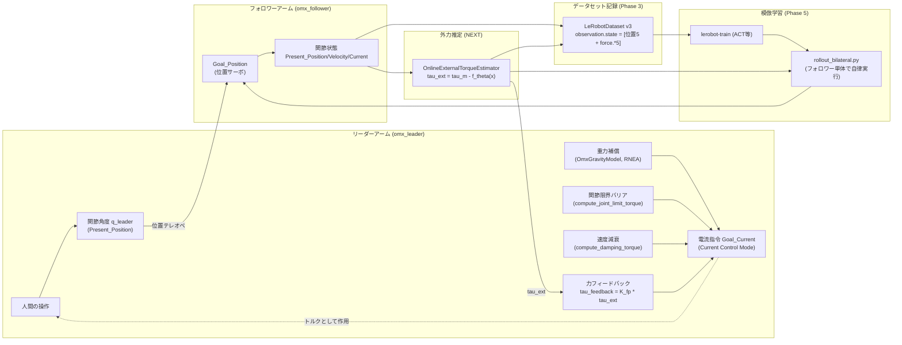
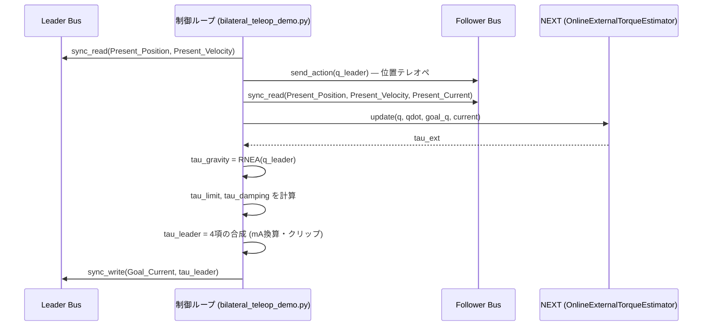
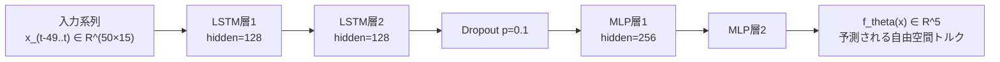

# OMX バイラテラル力フィードバックテレオペレーション 技術レポート

対象機体: ROBOTIS OpenManipulator-X (`omx_follower` / `omx_leader`) ・ フレームワーク: [HuggingFace LeRobot](https://github.com/huggingface/lerobot) ・ ブランチ: `exp/omx-force-feedback`

> 本書は Markdown 形式で記述しており、`pandoc examples/omx/TECHNICAL_REPORT_ja.md -o report.pdf` 等でPDF化できます。数式は `$...$`（インライン）/ `$$...$$`（ブロック）のLaTeX記法、図は Mermaid のフェンスコードブロックを使用しています。GitHub上ではどちらもそのまま描画されます。pandocでPDF化する場合、Mermaid図の描画には別途 `mermaid-filter` 等が必要です。英語版は [`TECHNICAL_REPORT_en.md`](./TECHNICAL_REPORT_en.md) を参照してください。

---

## Abstract

専用の力覚/トルクセンサを持たない廉価な5自由度マニピュレータ ROBOTIS OpenManipulator-X 上で、FACTR2 の **NEXT (Neural External Torque Estimation)** を再現し、モータの `Present_Current`/`Present_Load` 値のみから外力を推定した。これをリーダーアームへのフォースフィードバックに用いる **バイラテラルテレオペレーション** を構築し、さらに推定外力を LeRobot v3 データセットの `observation.state` に統合することで、力情報を伴う模倣学習用デモンストレーションの記録と、学習済みポリシーの実機推論までを一貫したパイプラインとして実装した。開発の過程で、Dynamixelファームウェアの `Torque_Enable` 切り替えに起因するグリッパの誤動作バグの発見・修正、および腕を伸展した際に生じる手先位置のズレ（重力補償の残差誤差に起因、既知の制約として受容）の切り分けも行った。

---

## 目次

1. [Overview](#1-overview)
2. [技術理論](#2-技術理論)
3. [実装したコードの紹介](#3-実装したコードの紹介)
4. [チュートリアル: 自由運動データ収集から力情報つきデータセット記録まで](#4-チュートリアル-自由運動データ収集から力情報つきデータセット記録まで)
5. [コマンドリファレンス](#5-コマンドリファレンス)
6. [参考文献](#6-参考文献)

---

## 1. Overview

### 1.1 背景と目的

模倣学習（Imitation Learning）による自律ロボット操作の学習には、人がロボットを操作して収集する高品質なデモンストレーションデータが不可欠である。特に物体との接触を伴うタスク（挿入、はめ込み、押し当てなど）では、視覚情報だけでは「接触したかどうか」「どの程度の力がかかっているか」を判断しづらく、力情報を伴うデモンストレーションが有効だと考えられる。

しかし多くの廉価なロボットアーム（本機を含む）には専用の力覚/トルクセンサが搭載されていない。そこで本プロジェクトでは、FACTR2 が提案する **NEXT** という手法を使い、モータ自体が持つ電流/負荷レジスタの値だけから外力を推定する。この推定外力を使って、

1. リーダーアームへのフォースフィードバック（バイラテラルテレオペレーション）を実現し、
2. 記録するデータセットの観測に力情報を折り込み、
3. 学習したポリシーの推論時にも同じ力推定を使い続ける、

という一貫したパイプラインを、既存の HuggingFace LeRobot フレームワークの上に、コアクラス (`OmxFollower`/`OmxLeader`) を変更せずに追加実装した。

### 1.2 OMX-AI の紹介

**ROBOTIS OpenManipulator-X**（本書では通称 *OMX-AI* と呼ぶ）は、韓国 ROBOTIS 社が販売する教育・研究向けの小型ロボットアームである。LeRobot にはリーダー/フォロワー2台構成のバイラテラルテレオペレーションキットとして `omx_follower`（作業側）・`omx_leader`（操作側）の2クラスがあらかじめ統合されている。

| 項目 | 内容 |
|---|---|
| 自由度 | 5軸（shoulder_pan, shoulder_lift, elbow_flex, wrist_flex, wrist_roll）+ グリッパ |
| アクチュエータ | ROBOTIS Dynamixel Xシリーズ サーボモータ（詳細は下表） |
| 構成 | リーダー（人が操作）・フォロワー（作業側）の同型2アーム構成 |
| 通信 | Dynamixel TTL half-duplex シリアルバス（USB接続、`DynamixelMotorsBus`） |
| LeRobot対応 | `src/lerobot/robots/omx_follower/`, `src/lerobot/teleoperators/omx_leader/` として標準サポート済み |

フォロワーとリーダーでは、関節ごとに搭載されているモータの型番が異なる点に注意が必要である（§2.5で詳述する力推定上の制約に直結する）。

| 関節 | フォロワー | リーダー |
|---|---|---|
| shoulder_pan | XL430-W250 | XL330-M288 |
| shoulder_lift | XL430-W250 | XL330-M288 |
| elbow_flex | XL430-W250 | XL330-M288 |
| wrist_flex | XL330-M288 | XL330-M288 |
| wrist_roll | XL330-M288 | XL330-M288 |
| gripper | XL330-M288 | XL330-M077 |

### 1.3 システム全体像



### 1.4 対象ハードウェア構成

本レポートのコマンド例は、以下の構成を前提とする（環境に応じて読み替えること）。

| 項目 | 既定値 |
|---|---|
| フォロワー接続ポート | `/dev/ttyACM0` |
| リーダー接続ポート | `/dev/ttyACM1` |
| フォロワーID | `omx_follower` |
| リーダーID | `omx_leader` |
| リーダー用URDF | `omx_l.urdf`（[ROBOTIS-GIT/open_manipulator](https://github.com/ROBOTIS-GIT/open_manipulator/blob/main/open_manipulator_description/urdf/omx_l/omx_l.urdf) 由来、`--urdf_path` で指定） |

---

## 2. 技術理論

### 2.1 バイラテラル制御の基本原理

バイラテラルテレオペレーションは、リーダー（操作側）とフォロワー（作業側）の双方向で位置と力の情報をやり取りする遠隔操作方式である。フォロワーが環境から受ける外力の推定値 $\tau_{ext}$ をリーダー側のアクチュエータへフィードバックすることで、操作者は遠隔にいながら接触の感触を得ることができる。本実装では FACTR（原著）が採用する単純な比例フィードバック則を踏襲する。

$$
\tau_{feedback} = K_{fp} \cdot \tau_{ext}
$$

ここで $K_{fp}$ は実装上 `--feedback_gain` に対応するゲインである。リーダー側は Dynamixel の Current Control Mode で駆動し、以下4項を合成した電流指令 (`Goal_Current`) を毎制御ステップ書き込む。

$$
\tau_{leader} = \tau_{gravity} + \tau_{limit} + \tau_{damping} + \tau_{feedback}
$$

各項の詳細は §2.3・§2.4 で述べる。実装は `examples/omx/bilateral_teleop/bilateral_teleop_demo.py` のメインループに対応する。



`tau_ext` はフォロワーの生レジスタ単位（Nm換算していない、§2.5参照）であるため、その符号が「押し返す方向」と直感的に一致する保証はない。実機で確認した結果、`tau_ext` の符号（FACTR2/NEXTの定義そのまま、$\tau_{ext} = \tau_m - f_\theta(x)$）は直感と逆であった。この符号ズレはグリッパの `Drive_Mode` 不一致 (§2.7, Phase 6) のようなレジスタ設定ミスではない — アーム5関節の `Drive_Mode` はリーダー・フォロワーで一致しており、位置テレオペと重力補償も符号反転無しに正しく動作するため、ズレは「電流/トルクの残差をリーダーへの指令に変換する」用途固有のものと判断した。そこで `tau_ext` 自体は変更せず、フィードバック力への変換関数 `leader_safety.compute_feedback_torque()` の内部でのみ定数 `FEEDBACK_SIGN = -1.0` を掛けて補正するようにした。この修正により、**`--feedback_gain` は正の値（`0.3` 付近）を指定すれば直感通りの方向にフィードバックがかかる**（内部的には `-0.3` を指定していたときと数学的に同一の電流指令になる）。

#### 2.1.1 バイラテラル制御方式の分類

バイラテラル制御は、マスタ（リーダー）・スレーブ（フォロワー）双方の制御則の組み合わせにより、一般に以下の3方式に分類される（[日本機械学会 医工学テクノロジーwiki](https://www.jsme.or.jp/jsme-medwiki/doku.php?id=14:1010059) による分類、[9]）。

| 方式 | スレーブ側 | マスタ側 |
|---|---|---|
| **対称型** | 位置制御（マスタ位置が目標値） | 位置制御（スレーブ位置が目標値）。両アームが互いの位置を目標値として追従し合う閉ループを構成する。 |
| **力逆送型** | 位置制御（マスタ位置が目標値） | スレーブ側で検出された接触力が**逆送されてマスタアームを駆動する**。 |
| **力帰還型** | 位置制御（マスタ位置が目標値） | スレーブ側で検出された接触力を**目標値としてマスタアームが力制御される**（マスタ側に閉じた力制御ループを持つ）。 |

対称型は専用の力/トルクセンサを必要とせず、位置偏差そのものが仮想的なバネのように力を発生させる方式である。力逆送型・力帰還型はいずれもスレーブ側で検出した接触力を使うが、両者の違いはマスタ側の扱いにある。力逆送型はスレーブの検出力を加算的にマスタへ「送り返して駆動する」のに対し、力帰還型はマスタ自身の発生力を検出力に追従させる**独立した力制御閉ループ**を持ち、力逆送型と比べて力感度が向上し、アームの見かけの慣性も低くできるとされる。

**今回の実装は「力逆送型」に該当する。** §2.1 の合成式

$$
\tau_{leader} = \tau_{gravity} + \tau_{limit} + \tau_{damping} + \underbrace{K_{fp} \cdot \tau_{ext}}_{\tau_{feedback}}
$$

の $\tau_{feedback}$ 項は、フォロワー側の推定外力 $\tau_{ext}$ に比例ゲイン $K_{fp}$ を掛けてリーダーの電流指令へ**加算するのみ**であり、リーダー自身が発生している力を測定して目標力へ閉ループで追従させる仕組みは持たない。これは「スレーブ側で検出された接触力がマスタ側に逆送されてマスタアームを駆動する」という力逆送型の定義に構造上正確に一致する。位置制御についても、フォロワーがリーダーの位置を目標値として追従する（`follower_action = {j.pos: q_leader[j] for j in ARM_JOINTS}` → `follower.send_action()`）点は力逆送型の前提と一致する。

ただし力逆送型の定義は「スレーブ側で**検出**された接触力」を前提とするのに対し、本実装のフォロワーには専用の力/トルクセンサが無く、NEXT（§2.2）によりモータ電流値から外力を**推定**している。したがって本実装は、**力センサレスの力逆送型バイラテラル制御**と表現するのが最も正確である。

### 2.2 NEXTによる外力推定

フォロワー側の Dynamixel には専用の力覚/トルクセンサが無いため、FACTR2 が提案する **NEXT (Neural External Torque Estimation)** を再現した。基本的な考え方は、「接触が無い自由空間で観測されるはずのモータ電流/負荷」を関節角度・速度・目標追従誤差の時系列からニューラルネットで学習し、実測値との残差を外力推定値とすることである。

**特徴量ベクトル**（時刻 $t$、関節数 $n=5$）:

$$
x_t = \big[\, q_t,\ \dot q_t,\ q_{goal,t} - q_t \,\big] \in \mathbb{R}^{3n}
$$

直近 `history_length`（既定50ステップ）分の $x_{t-49}, \dots, x_t$ を時系列として LSTM に入力する。

**モデル構成**（`src/lerobot/force_estimation/next_model.py`）:



**推論則**（FACTR2 論文 eq. 2 に対応）:

$$
\tau_{ext} = \tau_m - f_\theta(x)
$$

$\tau_m$ は実測のモータ電流/負荷（`Present_Current`）、$f_\theta(x)$ は学習済みモデルによる自由空間トルクの予測値である。

**学習**: 約10分・100Hzの接触なし自由運動データに対し、L2回帰（AdamW, `lr=1e-3`, `weight_decay=1e-6`）で学習する。

$$
\mathcal{L}(\theta) = \frac{1}{N}\sum_{i=1}^{N} \big\| \tau_{m,i} - f_\theta(x_i) \big\|_2^2
$$

入出力は標準化（zero-mean, unit-std）して学習し、標準化統計量 $(\mu_x, \sigma_x, \mu_y, \sigma_y)$ はチェックポイントに保存され、推論時 (`OnlineExternalTorqueEstimator`) に自動適用される。

$$
\hat x = \frac{x - \mu_x}{\sigma_x}, \qquad f_\theta(x) = f_\theta^{norm}(\hat x) \cdot \sigma_y + \mu_y
$$

対応実装: `src/lerobot/force_estimation/{next_model.py, dataset.py, train.py, online.py}`。

### 2.3 重力補償 (RNEA)

リーダーアームを Current Control Mode で駆動すると、ファームウェアの位置サーボが働かないため、アーム自重を打ち消す重力補償トルクを毎ステップ計算して加算する必要がある。マニピュレータの一般的な運動方程式は

$$
M(q)\ddot q + C(q,\dot q)\dot q + g(q) = \tau
$$

であり、$M(q)$ は慣性行列、$C(q,\dot q)$ はコリオリ・遠心力項、$g(q)$ が重力項である。RNEA (Recursive Newton-Euler Algorithm) に $\dot q = \ddot q = 0$ を代入すると、慣性項・コリオリ項がゼロになり、重力項 $g(q)$ のみが得られる。

$$
\tau_g = \mathrm{RNEA}(model,\ q,\ \mathbf{0},\ \mathbf{0}) = g(q)
$$

本実装では剛体動力学ライブラリ Pinocchio の `pin.rnea()` を用いる（`OmxGravityModel.compute_gravity_torque()`）。URDF はメッシュファイル無しでも読み込めるよう `pin.buildModelFromUrdf()`（`RobotWrapper.BuildFromURDF` ではなく）を用いている。

LeRobotの正規化位置 (`RANGE_M100_100`, $-100$〜$100$) から URDF のラジアン表現への変換は以下の式で行う。

$$
q_{rad} = s_j \cdot \frac{q_{norm}}{100} \cdot \pi + o_j
$$

$s_j$（`joint_sign`、既定 $+1$）・$o_j$（`joint_offset_rad`、既定 $0$）は関節ごとの符号・オフセットパラメータであり、実機で `preview_gravity_model.py` を使って確認済みである。

得られたトルク $\tau_g$（Nm）は、経験的トルク定数 $K_T$（`KT_NM_PER_A = 0.36`）とゲイン `modifier` を用いて電流指令（mA）に変換される。

$$
I_{gravity}\,[\mathrm{mA}] = \frac{\tau_g}{K_T} \cdot \mathrm{modifier} \cdot 1000
$$

対応実装: `src/lerobot/teleoperators/omx_leader/gravity_compensation.py`, `leader_safety.py`。

### 2.4 安全機構: 関節限界バリアと速度減衰

Dynamixel の Current Control Mode にはファームウェアの位置サーボが存在せず、`Min/Max_Position_Limit` は一切効かない。そのためソフトウェア側で FACTR方式のソフト関節限界バリアを実装し、暴走を防止している。安全マージン $m$（`JOINT_LIMIT_SAFETY_MARGIN = 5.0`）だけ内側に縮めた範囲 $[q_{lo}+m,\ q_{hi}-m]$ の外側でのみ、反発力が働く。

$$
\tau_{limit} =
\begin{cases}
-k_p (q - (q_{hi}-m)) - k_d \dot q & \text{if } q > q_{hi}-m \\
-k_p (q - (q_{lo}+m)) - k_d \dot q & \text{if } q < q_{lo}+m \\
0 & \text{otherwise}
\end{cases}
$$

加えて、操作性を保つための速度減衰項を常時加算する。

$$
\tau_{damping} = -k_{damp} \cdot \dot q
$$

実機で確認したハードウェア固有の関節限界（正規化単位、リーダー1台で計測）は以下の通り。

| 関節 | 下限 | 上限 |
|---|---|---|
| shoulder_pan | -52.4 | 50.9 |
| shoulder_lift | -68.0 | 48.2 |
| elbow_flex | -59.3 | 54.3 |
| wrist_flex | -48.8 | 50.3 |
| wrist_roll | -100.0 | 100.0（連続回転関節） |

対応実装: `src/lerobot/teleoperators/omx_leader/leader_safety.py` (`JOINT_LIMIT_RANGE`, `compute_joint_limit_torque`, `compute_damping_torque`)。

### 2.5 Dynamixelレジスタと力推定の制約

外力推定の入力に使う「電流」はモータ機種によって物理的な意味が異なる。フォロワーの `shoulder_pan`/`shoulder_lift`/`elbow_flex` は XL430-W250 で、LeRobot が一律 `Present_Current` と呼ぶレジスタは実際には ROBOTIS e-manual 上の **Present Load**（内部PWMデューティ比から推定した負荷率、単位0.1%）であり、真の電流値ではない。一方 `wrist_flex`/`wrist_roll` は XL330-M288 で、こちらは電流センサを持つが、モータ相電流ではなく入力電源側電流を測定している。

物理的な意味が関節ごとに異なるため、本実装ではトルク定数によるNm換算は行わず、各関節の生レジスタ値を「その関節固有のトルク代理信号」として扱い、標準化とデータ駆動のLSTM（§2.2）にスケール差の吸収を委ねている。

### 2.6 データセットへの力情報統合

推定外力を模倣学習に使うには、LeRobot v3 データセットの特徴量として記録する必要がある。ここで `observation.force` のような別キーではなく、既存の `observation.state` を拡張（位置5次元 + 力5次元 = 10次元）する設計を採った。

$$
\texttt{observation.state} = [\,q_{shoulder\_pan}, \dots, q_{wrist\_roll},\ \tau_{ext,shoulder\_pan}, \dots, \tau_{ext,wrist\_roll}\,] \in \mathbb{R}^{10}
$$

理由は、`PreTrainedConfig.robot_state_feature`（`src/lerobot/configs/policies.py`）がポリシーの入力として自動的に扱うのは厳密にキー名 `"observation.state"` のみであり、それ以外の `observation.*` キーはポリシー側のコード変更なしには学習に使われないためである。この拡張は既存ユーティリティ `combine_feature_dicts()` のみで実現でき、`OmxFollower` 等のコアクラスには一切手を入れていない。

### 2.7 実装上判明した落とし穴

**Dynamixel `Torque_Enable` 切替の副作用（Phase 6）**: Dynamixel の `Torque_Enable` を OFF→ON と切り替えると、`CURRENT_POSITION` モードのモータは、その瞬間の `Present_Position` に `Goal_Position` が再ロックされたかのように振る舞うことを実機で確認した。これは LeRobot 側の `enable_torque()`/`disable_torque()`（`Torque_Enable` レジスタの書き込みのみ）の挙動ではなく、Dynamixelファームウェア側の挙動である。対象モータを指定しない `torque_disabled()` 呼び出しは、意図しないモータ（本実装ではグリッパ）まで巻き込んでしまうため、**対象モータは常に明示的に絞り込む**必要がある。

**重力補償の残差誤差とヤコビアンによる増幅（Phase 7）**: リーダーアームを大きく伸展した姿勢では、フォロワーの手先位置が最大1〜2cm程度ズレることを確認した。原因の切り分けの結果、関節限界バリア・速度減衰はいずれも定常状態（姿勢を静止保持した状態、$\dot q \approx 0$）では寄与せず、静止時にも常に働き続ける **重力補償の残差誤差** が原因と特定した。関節角度の誤差 $\delta q$ は、ヤコビアン $J(q)$ を介して手先位置誤差に変換される。

$$
\delta x \approx J(q)\, \delta q
$$

ヤコビアンのノルムは、一般にアームを伸展するほど（基部からの距離が長くなるほど）大きくなるため、関節角度としては同程度の誤差でも、伸展姿勢ではより大きな手先位置誤差として現れる（いわゆるレバーアーム効果）。加えて、伸展姿勢では必要な重力補償トルク自体も大きくなるため、比例的なゲイン誤差の絶対量も大きくなりやすい。`--modifier` は「触った感触で快適」なレベルの経験的ゲインであり、物理的に正確な較正ではないため、この誤差は現状 **既知の制約として受容** している。

---

## 3. 実装したコードの紹介

### 3.1 コアパッケージ (`src/lerobot/`)

既存クラス (`OmxFollower`/`OmxLeader`) は変更せず、追加のみで構成している。

| ファイル | 役割 |
|---|---|
| `force_estimation/next_model.py` | `NextTorqueEstimator`（`nn.Module`）。2層LSTM (hidden=128) + 2層MLPヘッド (hidden=256)、dropout 0.1 の FACTR2 NEXT モデル本体。 |
| `force_estimation/dataset.py` | `FreeMotionEpisode`, `load_episode()`, `resample_uniform()`, `NextWindowDataset`。`.npz`ログの読み込み・一定レートへのリサンプリング・学習用ウィンドウ抽出。 |
| `force_estimation/train.py` | `NextTrainConfig`, `train_next()`。L2回帰・早期終了による学習ループ。標準化統計量を含めてチェックポイント保存。 |
| `force_estimation/online.py` | `OnlineExternalTorqueEstimator`。リングバッファで履歴を保持し、1ステップごとに $\tau_{ext}$ を計算。`smoothing_alpha` によるオプションのEMA平滑化に対応。 |
| `teleoperators/omx_leader/gravity_compensation.py` | `OmxGravityModel`。Pinocchio RNEA を用いた重力補償トルク計算と、URDF関節名へのマッピング。既知の制約（Phase 7）を記載。 |
| `teleoperators/omx_leader/leader_safety.py` | リーダー制御の共通ロジック: Current Control Mode の出入り (`enter_current_control_mode`/`restore_position_mode`)、関節限界バリア、速度減衰、per-jointゲイン解決。Phase 6 のバグ修正箇所。 |

### 3.2 スクリプト群 (`examples/omx/`)

**力推定パイプライン** (`force_sensing/`)

| ファイル | 役割 |
|---|---|
| `collect_free_motion.py` | 接触なし自由運動データの収集。`record_grab.py` の安全な関節連動範囲を再利用。 |
| `train_next.py` | `train_next()` のCLIラッパー。 |
| `demo_force_sensing.py` | 実機でのリアルタイム外力推定デモ。 |
| `evaluate_free_motion.py` | 収集済み自由運動ログを推論に流し、ノイズフロアの基準値（`mean`/`std`/`max|.|`、+側/-側の非対称性内訳）を算出。 |
| `evaluate_dataset_force.py` | 記録済みLeRobotデータセットの `observation.state` から `force.*` 列を抽出し、全体・エピソードごとの統計量を表示。 |

**重力補償** (`gravity_compensation/`)

| ファイル | 役割 |
|---|---|
| `preview_gravity_model.py` | 電流を流さず、RNEA計算結果をコンソール表示するだけの読み取り専用診断。符号・URDFマッピングの検証用。 |
| `find_leader_joint_range.py` | トルクを切った状態で手動で動かし、各関節の実用可動範囲を計測。 |
| `gravity_comp_demo.py` | 重力補償 + 関節限界バリア + 減衰のみの単体デモ。バイラテラル系スクリプトの土台。 |

**バイラテラル制御** (`bilateral_teleop/`)

| ファイル | 役割 |
|---|---|
| `bilateral_teleop_demo.py` | 位置テレオペ + フォースフィードバックの本体ループ。 |
| `record_bilateral.py` | 上記ループに LeRobotDataset 記録を追加。カメラ・Hub アップロード・`--resume` 対応。 |
| `rollout_bilateral.py` | リーダー無し・フォロワー単体で学習済みポリシーを自律実行。 |

**診断スクリプト** (`examples/omx/` 直下)

| ファイル | 役割 |
|---|---|
| `diagnose_gripper.py` | グリッパの `Drive_Mode`/`Homing_Offset` 診断、グリッパ中継のみのライブテスト、Current Control Mode の影響切り分け（Phase 6）。 |
| `diagnose_pose.py` | リーダー・フォロワーの関節角度をライブ比較（Phase 7）。 |

---

## 4. チュートリアル: 自由運動データ収集から力情報つきデータセット記録まで

このチュートリアルでは、何もない状態から (1) NEXT外力推定モデルを学習し、(2) バイラテラルテレオペレーションの動作を確認し、(3) 力情報つきのデモンストレーションデータセットを記録するまでを、実行順に説明する。全てリポジトリルートから `uv run python -m examples.omx....` の形式で実行する。

### Step 0: 環境準備

```bash
uv sync --extra dataset --extra kinematics --extra dev --extra test
```

`kinematics` extra が Pinocchio（重力補償に必要）を含む。フォロワー・リーダーをそれぞれUSB接続し、ポート（既定 `/dev/ttyACM0`/`/dev/ttyACM1`）を確認しておく。

### Step 1: 自由運動データ収集

接触の無い自由空間でのモータ挙動を学習するため、ワークスペースに物を置かず、フォロワー単体を10分程度動かしてログを取る。

```bash
uv run python -m examples.omx.force_sensing.collect_free_motion \
    --port /dev/ttyACM0 --robot_id omx_follower \
    --output data/omx_free_motion/run1.npz --duration_min 12
```

複数回（別セッション）に分けて収集してもよい。**確認事項**: 収集中に `Hardware_Error_Status` による中断が発生していないか、ログに表示されるコンソール出力を確認する。

### Step 2: NEXTモデル学習

```bash
uv run python -m examples.omx.force_sensing.train_next \
    --data data/omx_free_motion/run1.npz data/omx_free_motion/run2.npz \
    --output checkpoints/omx_next.pt
```

**確認事項**: 学習ログの検証損失 (validation loss) が early stopping まで単調に近い形で下がっているか。`--resample-hz` は既定100だが、後段（Step 5以降）で実測したバイラテラルループの実測レートに合わせて調整するとよい（§2.2、および `src/lerobot/force_estimation/README.md` のチューニング節を参照）。

### Step 3: NEXT検証

学習済みモデルが接触なしデータに対してノイズだけを出力するか（自由空間モデルとして妥当か）を確認する。

```bash
uv run python -m examples.omx.force_sensing.evaluate_free_motion \
    --checkpoint checkpoints/omx_next.pt \
    --data data/omx_free_motion/run1.npz data/omx_free_motion/run2.npz
```

**確認事項**: 出力される `mean`/`std`/`max|.|` が0付近の小さい値に収まっているか。次に、実機で関節を押して応答を確認する。

```bash
uv run python -m examples.omx.force_sensing.demo_force_sensing \
    --port /dev/ttyACM0 --checkpoint checkpoints/omx_next.pt
```

**確認事項**: 各関節を軽く/強く押した際に `tau_ext` の符号・大小が力の向き・強さと定性的に一致するか。

### Step 4: 重力補償の準備・検証

まずリーダー側の符号・URDFマッピングを、電流を流さずに確認する。

```bash
uv run python -m examples.omx.gravity_compensation.preview_gravity_model \
    --port /dev/ttyACM1 --robot_id omx_leader --urdf_path /path/to/omx_l.urdf
```

**確認事項**: 表示される角度・トルクの符号が物理的に妥当か（アームを動かした時、トルクの向きが直感と一致するか）。まだ確認できていない場合は、可動範囲も測定しておく。

```bash
uv run python -m examples.omx.gravity_compensation.find_leader_joint_range \
    --port /dev/ttyACM1 --robot_id omx_leader
```

出力される `JOINT_LIMIT_RANGE = {...}` を `src/lerobot/teleoperators/omx_leader/leader_safety.py` の値と照合・更新する（既に本レポート §2.4 の値が設定済みであれば不要）。最後に、重力補償単体の動作を確認する。**アームを手で支えた状態で開始すること。**

```bash
uv run python -m examples.omx.gravity_compensation.gravity_comp_demo \
    --port /dev/ttyACM1 --robot_id omx_leader --urdf_path /path/to/omx_l.urdf \
    --modifier 0.09 --damping_gain 0.05 --joint_limit_kp 3 --joint_limit_kd 0
```

**確認事項**: アームから手を離しても自重で落下しないか、関節限界付近で振動しないか。

### Step 5: バイラテラルテレオペレーションの動作確認

まず `--feedback_gain` を既定の `0.0`（無効）のまま実行し、位置テレオペ + 安全機構だけの動作を確認する。**初回はアームを手で支えた状態で開始すること。**

```bash
uv run python -m examples.omx.bilateral_teleop.bilateral_teleop_demo \
    --follower_port /dev/ttyACM0 --follower_id omx_follower \
    --leader_port /dev/ttyACM1 --leader_id omx_leader \
    --urdf_path /path/to/omx_l.urdf --checkpoint checkpoints/omx_next.pt \
    --modifier 0.09 --modifier_shoulder_lift 0.1 \
    --modifier_shoulder_pan 0.0 --modifier_wrist_roll 0.0 \
    --damping_gain 0.05 --joint_limit_kp 3 --joint_limit_kd 0
```

**確認事項**: コンソールに毎秒表示される実測Hzと `tau_ext` を確認する。フォロワーがリーダーの動きに正しく追従するか（グリッパを含む）を確認する。動作に問題が無ければ、フォースフィードバックを有効にする。

```bash
uv run python -m examples.omx.bilateral_teleop.bilateral_teleop_demo \
    --follower_port /dev/ttyACM0 --leader_port /dev/ttyACM1 \
    --urdf_path /path/to/omx_l.urdf --checkpoint checkpoints/omx_next.pt \
    --modifier 0.09 --modifier_shoulder_lift 0.1 \
    --modifier_shoulder_pan 0.0 --modifier_wrist_roll 0.0 \
    --damping_gain 0.05 --joint_limit_kp 3 --joint_limit_kd 0 \
    --feedback_gain 0.3
```

**確認事項**: フォロワーの手先を押した際、リーダー側にその反力が伝わるか。反力の向きが逆に感じる場合は `--feedback_gain` の符号を反転する。

### Step 6: 力情報つきデータセットの記録

動作確認が済んだら、同じパラメータで記録スクリプトに切り替える。

```bash
uv run python -m examples.omx.bilateral_teleop.record_bilateral \
    --follower_port /dev/ttyACM0 --leader_port /dev/ttyACM1 \
    --urdf_path /path/to/omx_l.urdf --checkpoint checkpoints/omx_next.pt \
    --modifier 0.09 --modifier_shoulder_lift 0.1 \
    --modifier_shoulder_pan 0.0 --modifier_wrist_roll 0.0 \
    --damping_gain 0.05 --joint_limit_kp 3 --joint_limit_kd 0 --feedback_gain 0.3 \
    --repo_id <hf_username>/omx_bilateral_force --root data/omx_bilateral_force \
    --num_episodes 10 --episode_duration_s 30 --single_task "Pick up the cube" \
    --cameras="{ wrist: {type: opencv, index_or_path: 6, width: 640, height: 480, fps: 30, fourcc: MJPG} }" \
    --push_to_hub --hub_private --hub_tags omx bilateral force
```

**確認事項**: 起動直後のログに表示される `observation.state` の次元数・`names`（位置5 + `force.*` 5 = 10次元になっているか）を確認する。エピソードの続きから記録する場合は `--resume`（`--root` の指定が必須）を追加する。

**補足（データ品質のチューニングが必要な場合）**: 記録したデータセットの `force.*` 列の分布を確認したい場合は、以下で診断できる（§2.2・§2.7、および `src/lerobot/force_estimation/README.md` の「チューニング」節も参照）。

```bash
uv run python -m examples.omx.force_sensing.evaluate_dataset_force \
    --repo_id <hf_username>/omx_bilateral_force --root data/omx_bilateral_force
```

---

## 5. コマンドリファレンス

### `force_sensing/collect_free_motion.py`

| 引数 | 型 | 既定値 | 説明 |
|---|---|---|---|
| `--port` | str | `/dev/ttyACM0` | フォロワー接続ポート |
| `--robot_id` | str | `omx_follower` | フォロワーID |
| `--output` | str | 必須 | 出力 `.npz` パス |
| `--duration_min` | float | — | 収集時間（分） |

### `force_sensing/train_next.py`

| 引数 | 型 | 既定値 | 説明 |
|---|---|---|---|
| `--data` | str+ | 必須 | `.npz` 自由運動ログ（複数可） |
| `--output` | str | 必須 | 出力チェックポイントパス |
| `--history-length` | int | `50` | 履歴長 |
| `--resample-hz` | float | `100.0` | 学習時のリサンプリング周波数 |
| `--batch-size` | int | `256` | バッチサイズ |
| `--max-epochs` | int | `200` | 最大エポック数 |
| `--patience` | int | `15` | 早期終了の忍耐値 |
| `--lr` | float | `1e-3` | 学習率 |
| `--weight-decay` | float | `1e-6` | AdamW weight decay |

### `force_sensing/demo_force_sensing.py`

| 引数 | 型 | 既定値 | 説明 |
|---|---|---|---|
| `--port` | str | `/dev/ttyACM0` | フォロワー接続ポート |
| `--robot_id` | str | `omx_follower` | フォロワーID |
| `--checkpoint` | str | 必須 | NEXTチェックポイントパス |
| `--hz` | float | `100.0` | 制御ループ周波数 |

### `force_sensing/evaluate_free_motion.py`

| 引数 | 型 | 既定値 | 説明 |
|---|---|---|---|
| `--checkpoint` | str | 必須 | NEXTチェックポイントパス |
| `--data` | str+ | 必須 | 評価対象の `.npz` ログ（複数可） |

### `force_sensing/evaluate_dataset_force.py`

| 引数 | 型 | 既定値 | 説明 |
|---|---|---|---|
| `--repo_id` | str | 必須 | `<hf_username>/<dataset_name>` |
| `--root` | str | `None` | ローカルデータセットディレクトリ |
| `--episode_index` | int | `None` | 指定エピソードのタイムラインも表示 |
| `--episode_stride` | int | `5` | タイムライン表示の間引き幅 |

### `gravity_compensation/preview_gravity_model.py`

| 引数 | 型 | 既定値 | 説明 |
|---|---|---|---|
| `--port` | str | `/dev/ttyACM1` | リーダー接続ポート |
| `--robot_id` | str | `omx_leader` | リーダーID |
| `--urdf_path` | str | 必須 | `omx_l.urdf` へのパス |
| `--hz` | float | `20.0` | 表示更新周波数 |

### `gravity_compensation/find_leader_joint_range.py`

| 引数 | 型 | 既定値 | 説明 |
|---|---|---|---|
| `--port` | str | `/dev/ttyACM1` | リーダー接続ポート |
| `--robot_id` | str | `omx_leader` | リーダーID |
| `--hz` | float | `20.0` | 表示更新周波数 |

### `gravity_compensation/gravity_comp_demo.py`

| 引数 | 型 | 既定値 | 説明 |
|---|---|---|---|
| `--port` | str | `/dev/ttyACM1` | リーダー接続ポート |
| `--robot_id` | str | `omx_leader` | リーダーID |
| `--urdf_path` | str | 必須 | `omx_l.urdf` へのパス |
| `--modifier` | float | `0.09` | 重力補償ゲイン（`--modifier_<joint>` で関節別上書き可） |
| `--damping_gain` | float | `0.05` | 速度減衰ゲイン（関節別上書き可） |
| `--joint_limit_kp` | float | `3.0` | 関節限界バリア Pゲイン（関節別上書き可） |
| `--joint_limit_kd` | float | `0.0` | 関節限界バリア Dゲイン（関節別上書き可） |
| `--current_limit_ma` | int | `500` | 関節ごとの電流上限 |
| `--hz` | float | `50.0` | 制御ループ周波数 |

### `bilateral_teleop/bilateral_teleop_demo.py`

| 引数 | 型 | 既定値 | 説明 |
|---|---|---|---|
| `--follower_port` | str | `/dev/ttyACM0` | フォロワー接続ポート |
| `--follower_id` | str | `omx_follower` | フォロワーID |
| `--leader_port` | str | `/dev/ttyACM1` | リーダー接続ポート |
| `--leader_id` | str | `omx_leader` | リーダーID |
| `--urdf_path` | str | 必須 | `omx_l.urdf` へのパス |
| `--checkpoint` | str | 必須 | NEXTチェックポイントパス |
| `--force_smoothing_alpha` | float | `None` | `tau_ext` のEMA平滑化係数（無効時は生値） |
| `--modifier` / `--damping_gain` / `--joint_limit_kp` / `--joint_limit_kd` | float | `gravity_comp_demo.py` と同じ | 関節別上書き可 |
| `--feedback_gain` | float | `0.0` | フォースフィードバックゲイン（`0.0`=無効、関節別上書き可） |
| `--current_limit_ma` | int | `500` | 関節ごとの電流上限（全項合算後の最終クリップ） |
| `--feedback_limit_ma` | int | `200` | フィードバック項単体の電流上限 |
| `--hz` | float | `50.0` | 制御ループ周波数 |

### `bilateral_teleop/record_bilateral.py`

上記 `bilateral_teleop_demo.py` の全引数に加えて:

| 引数 | 型 | 既定値 | 説明 |
|---|---|---|---|
| `--cameras` | str | `None` | カメラ設定（YAML風dict-of-dataclass構文） |
| `--repo_id` | str | 必須 | `<hf_username>/<dataset_name>` |
| `--root` | str | `None` | ローカルデータセットディレクトリ |
| `--resume` | flag | — | 既存データセットにエピソードを追加（`--root` 必須） |
| `--num_episodes` | int | `10` | 今回のセッションで新規記録するエピソード数 |
| `--episode_duration_s` | float | `30.0` | 1エピソードの長さ（秒） |
| `--single_task` | str | 必須 | タスクの説明文 |
| `--fps` | int | `30` | データセットのfpsメタ情報（`--hz` とは独立） |
| `--no_video` | flag | — | カメラフレームを動画でなく画像として保存 |
| `--push_to_hub` | flag | — | 記録終了後にHubへアップロード |
| `--hub_private` | flag | — | Hubリポジトリを非公開で作成（`--push_to_hub` と併用） |
| `--hub_tags` | str+ | `None` | Hubデータセットカードのタグ（`--push_to_hub` と併用） |

### `bilateral_teleop/rollout_bilateral.py`

| 引数 | 型 | 既定値 | 説明 |
|---|---|---|---|
| `--follower_port` | str | `/dev/ttyACM0` | フォロワー接続ポート |
| `--follower_id` | str | `omx_follower` | フォロワーID |
| `--cameras` | str | `None` | カメラ設定（学習時と一致させる） |
| `--checkpoint` | str | 必須 | NEXTチェックポイントパス |
| `--policy_path` | str | 必須 | 学習済みポリシーのパス／HFリポジトリID |
| `--task` | str | `""` | タスク文字列（記録時の `--single_task` と同じ） |
| `--force_smoothing_alpha` | float | `None` | `tau_ext` のEMA平滑化係数 |
| `--device` | str | `None` | 推論デバイス上書き（既定: cuda優先、無ければcpu。`mps`は既定で自動選択しない） |
| `--hz` | float | `50.0` | 制御ループ周波数 |
| `--num_steps` | int | `200` | 実行ステップ数上限（Ctrl+Cでも停止可） |

### `diagnose_gripper.py`

| 引数 | 型 | 既定値 | 説明 |
|---|---|---|---|
| `--follower_port` / `--follower_id` / `--leader_port` / `--leader_id` | — | 既定は他スクリプトと同じ | 接続設定 |
| `--skip_follower` / `--skip_leader` | flag | — | 片方だけ診断 |
| `--hz` | float | `10.0` | 手動マッピング／ライブ中継の表示周波数 |
| `--live_relay` | flag | — | グリッパ中継のみのライブテストに切り替え（リーダー・フォロワー両方必須） |
| `--with_arm_current_control` | flag | — | `--live_relay` 時、リーダーのアーム関節もCurrent Control Modeへ切り替え |
| `--arm_current_ma` | int | `0` | `--with_arm_current_control` 時にアーム関節へ書き込む電流 |
| `--gripper_current_limit_ma` | int | `100` | グリッパの `Current_Limit`/`Goal_Current` を上書き |
| `--scope_arm_torque_disable` | flag | — | `torque_disabled()` を `ARM_JOINTS` のみへ限定する候補修正のA/Bテスト |

### `diagnose_pose.py`

| 引数 | 型 | 既定値 | 説明 |
|---|---|---|---|
| `--follower_port` / `--follower_id` / `--leader_port` / `--leader_id` | — | 既定は他スクリプトと同じ | 接続設定 |
| `--urdf_path` | str | 必須 | `omx_l.urdf` へのパス |
| `--modifier` / `--damping_gain` / `--joint_limit_kp` / `--joint_limit_kd` | float | `gravity_comp_demo.py` と同じ | 関節別上書き可 |
| `--current_limit_ma` | int | `500` | 関節ごとの電流上限 |
| `--hz` | float | `50.0` | 制御ループ周波数 |
| `--passive_relay` | flag | — | リーダーのアーム関節をCurrent Control Modeへ切り替えず、`lerobot-teleop` 相当の完全受動状態のまま位置中継 |

---

## 6. 参考文献

1. **FACTR2: Neural External Torque Estimation for Force-Feedback Teleoperation** — arXiv:2606.12406。NEXT (Neural External Torque Estimation) の理論的基盤。LSTM+MLPによる自由空間トルク予測と、実測値との残差による外力推定（§2.2）は本論文の手法を再現したもの。
2. **FACTR（原著）** — Force-Feedback Assisted Compliant Teleoperation、FACTR2 の前身研究。比例則によるバイラテラルフォースフィードバック（§2.1）、および FACTR方式のソフト関節限界バリア（§2.4）の参照元。
3. **HuggingFace LeRobot** — [github.com/huggingface/lerobot](https://github.com/huggingface/lerobot)。本実装のベースフレームワーク。ロボット/テレオペレータ抽象化層、`LeRobotDataset`（v3形式）、ポリシー学習・推論パイプラインを利用。`omx_follower`/`omx_leader` は元々本フレームワークに統合済み。
4. **Pinocchio** — 高速剛体動力学ライブラリ（INRIA）。RNEA による重力補償トルク計算（§2.3）に使用。
5. **ROBOTIS OpenManipulator-X** — [github.com/ROBOTIS-GIT/open_manipulator](https://github.com/ROBOTIS-GIT/open_manipulator)。対象機体本体、およびリーダーアーム重力補償用URDFの出典。
6. **Dynamixel X-Series e-Manual** — ROBOTIS 公式ドキュメント（XL430-W250 / XL330-M288）。`Present_Current` レジスタの実体（§2.5）や Operating Mode の仕様確認に使用。
7. **`examples/so100_to_so100_EE/evaluate.py`**（LeRobot リポジトリ内） — `lerobot-rollout` CLI を使わない、標準ツールに依らないポリシー推論ループの参考実装。`rollout_bilateral.py` の実装パターンの土台。
8. **`examples/omx/record_grab.py`**（同リポジトリ内） — データセット記録の雛形、および `shoulder_lift`/`elbow_flex` の安全な連動範囲の参照元。
9. **日本機械学会 医工学テクノロジーwiki「バイラテラル制御」** — バイラテラル制御方式（対称型・力逆送型・力帰還型）の分類（§2.1.1）の出典。
   - 総論: [doku.php?id=14:1010059](https://www.jsme.or.jp/jsme-medwiki/doku.php?id=14:1010059)
   - 力逆送型: [doku.php?id=14:1008124](https://www.jsme.or.jp/jsme-medwiki/doku.php?id=14:1008124)
   - 力帰還型: [doku.php?id=14:1008123](https://www.jsme.or.jp/jsme-medwiki/doku.php?id=14:1008123)
